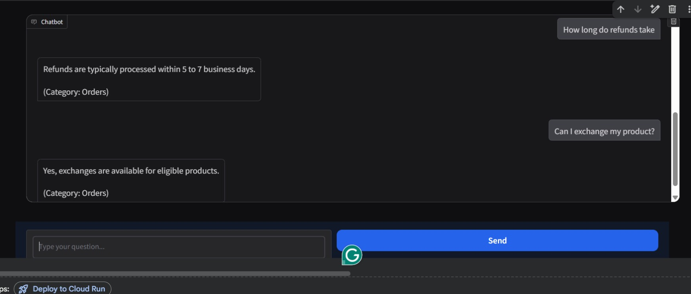

# 🤖 Smart FAQ Bot

An AI-powered FAQ Chatbot that uses **TF-IDF** and **Cosine Similarity** to match user questions with the most relevant answers from a CSV dataset — with a clean **Gradio** chat interface.

## 📸 Screenshots

## 🚀 How to Run

1. Open `FAQ_Chatbot.ipynb` in **Google Colab**
2. Run the first cell to install dependencies:
 pip install nltk scikit-learn pandas gradio
3. Upload your FAQ dataset (CSV file) when prompted
4. Run all cells — the **Gradio UI** will launch at the bottom

## 📁 Dataset Format

Your CSV file must have at least 2 columns:

| Question | Answer |
|----------|--------|
| What is your return policy? | You can return items within 30 days. |
| How do I reset my password? | Click on "Forgot Password" on the login page. |

An optional 3rd column **Category** is also supported.

## ⚙️ How It Works

1. Uploads and reads your FAQ CSV
2. Cleans and preprocesses the questions (removes stopwords, punctuation)
3. Converts questions into **TF-IDF vectors**
4. When a user types a question, it finds the **most similar question** using Cosine Similarity
5. Returns the matched answer (with category if available)

## 🛠️ Tech Stack

- Python
- NLTK
- Scikit-learn (TF-IDF + Cosine Similarity)
- Pandas & NumPy
- Gradio (Chat UI)

## 👩‍💻 Author

**ZarwaAyaz** — [GitHub Profile](https://github.com/ZarwaAyaz)
